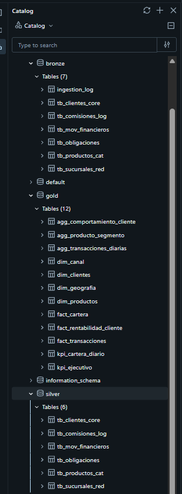

# FinBank Data Platform

## 1. Escenario seleccionado

**Sector:** Banca y Servicios Financieros  
**Empresa:** FinBank S.A.  
**Plataforma:** Databricks  
**Fuente:** Lakebase PostgreSQL  
**Motor:** Apache Spark / PySpark  
**Almacenamiento:** Delta Lake  
**Autor:** Mariano López

Se implementa una plataforma de datos para el análisis de clientes, productos, movimientos financieros, obligaciones, sucursales y comisiones.

La arquitectura utiliza el patrón **Medallion**, con Databricks como plataforma principal y Lakebase PostgreSQL como fuente relacional.

---

## 2. Objetivo

Implementar un pipeline end-to-end desde la fuente relacional hasta estructuras analíticas Gold.

La solución contempla:

- Generación de datos sintéticos.
- Carga en PostgreSQL.
- Ingesta Bronze.
- Transformación y calidad en Silver.
- Reglas de negocio en Gold.
- Dimensiones, hechos, agregaciones y KPIs.
- Protección de información sensible.
- Trazabilidad del procesamiento.

---

## 3. Arquitectura

```text
Lakebase PostgreSQL
        │
        ▼
     Bronze
        │
        ▼
     Silver
        │
        ▼
      Gold
```

| Capa | Responsabilidad |
|---|---|
| Bronze | Ingesta y preservación del origen |
| Silver | Limpieza, calidad y conformación |
| Gold | Modelo analítico, reglas y agregaciones |

---

## 4. Fuente de datos

| Tabla | Descripción | Registros |
|---|---|---:|
| `TB_CLIENTES_CORE` | Clientes | 10,000 |
| `TB_PRODUCTOS_CAT` | Productos | 50 |
| `TB_MOV_FINANCIEROS` | Movimientos financieros | 500,000 |
| `TB_OBLIGACIONES` | Obligaciones | 30,000 |
| `TB_SUCURSALES_RED` | Sucursales y puntos de atención | 200 |
| `TB_COMISIONES_LOG` | Comisiones | 80,000 |

Los datos son sintéticos y reproducibles mediante una semilla fija.

---

## 5. Generación de datos

Archivo:

```text
notebooks/01_generate_finbank_data.py
```

Genera y carga en Lakebase PostgreSQL los datos de clientes, productos, movimientos, obligaciones, sucursales y comisiones.

---

## 6. Bronze

Archivo:

```text
notebooks/01_bronze_ingestion.py
```

Bronze preserva la información proveniente de PostgreSQL antes de aplicar transformaciones de negocio.

Se realizan:

- Lectura desde PostgreSQL.
- Persistencia en Delta Lake.
- Conservación de los campos originales.
- Metadata técnica.
- Identificación del batch.
- Timestamp de ingesta.

Metadata principal:

```text
ingestion_timestamp
ingestion_source
ingestion_batch_id
is_active
is_deleted
```

---

## 7. Silver

Archivo:

```text
notebooks/02_silver_transformation.py
```

Silver contiene los datos depurados y conformados.

Se realizan:

- Validación de campos obligatorios.
- Deduplicación por PK.
- Integridad referencial.
- Estandarización de textos e importes.
- Protección de PII.
- Detección de transacciones sospechosas.

El número de documento se protege mediante SHA-256.

### Detección de anomalías

El campo `ind_sospechoso` se calcula en Silver utilizando el comportamiento histórico del cliente durante los últimos 30 días:

```text
vr_mov >
promedio de los últimos 30 días
+
3 × desviación estándar
```

El cálculo utiliza una ventana temporal particionada por `id_cli`.

---

## 8. Gold

Archivo:

```text
notebooks/03_gold_transformation.py
```

### Dimensiones

```text
finbank.gold.dim_clientes
finbank.gold.dim_productos
finbank.gold.dim_geografia
finbank.gold.dim_canal
```

### Hechos

```text
finbank.gold.fact_transacciones
finbank.gold.fact_cartera
finbank.gold.fact_rentabilidad_cliente
```

### Agregaciones y KPIs

```text
finbank.gold.kpi_cartera_diario
finbank.gold.agg_transacciones_diarias
finbank.gold.agg_producto_segmento
finbank.gold.agg_comportamiento_cliente
finbank.gold.kpi_ejecutivo
```

---

## 9. Modelo analítico

### `dim_clientes`

Incluye información del cliente, nombre completo, edad, segmento, ciudad, departamento e identificador documental protegido.

### `dim_productos`

Incluye descripción, familia, tasa efectiva anual y equivalente mensual.

### `dim_geografia`

Consolida la información geográfica disponible en `TB_SUCURSALES_RED`.

### `dim_canal`

Se construye utilizando la información disponible en `TB_SUCURSALES_RED`, manteniendo la diferencia entre los códigos de canal de movimientos y los tipos de punto cuando la fuente no proporciona una relación explícita.

### `fact_transacciones`

Construida desde `TB_MOV_FINANCIEROS`.

Incluye:

- Movimientos financieros validados.
- `flag_horario_habil`
- `ind_sospechoso`

`flag_horario_habil` identifica operaciones de lunes a viernes entre las 08:00 y 17:59.

### `fact_cartera`

Construida desde `TB_OBLIGACIONES`.

`bucket_mora` se determina mediante:

| Días de mora | Bucket |
|---:|---|
| 0 | `0` |
| 1–30 | `1–30` |
| 31–60 | `31–60` |
| 61–90 | `61–90` |
| >90 | `>90` |

### `fact_rentabilidad_cliente`

Consolida las comisiones efectivamente cobradas por cliente y mes.

Se calcula:

```text
cltv_12m_comisiones
```

correspondiente a las comisiones cobradas durante una ventana móvil de 12 meses.

No se estiman intereses cuando la fuente no permite calcularlos de forma sustentada.

---

## 10. KPIs y agregaciones

`kpi_cartera_diario` consolida información por fecha, producto, segmento y ciudad.

Principales métricas:

- Obligaciones activas.
- Monto de cartera.
- Monto vencido.
- Clientes con mora.
- Tasa de mora.

También se generan:

- `agg_transacciones_diarias`
- `agg_producto_segmento`
- `agg_comportamiento_cliente`
- `kpi_ejecutivo`

---

## 11. Calidad, idempotencia y trazabilidad

Se validan:

- Campos obligatorios.
- Duplicados.
- Claves primarias.
- Integridad referencial.
- Reglas de negocio.
- Estructuras Gold.
- Distribución de `bucket_mora`.

Las transformaciones utilizan operaciones determinísticas y persistencia controlada para evitar duplicaciones durante reprocesamientos.

Los atributos `batch_id` y timestamps permiten identificar cada ejecución.

---

## 12. Seguridad

La información sensible se protege antes de llegar a las estructuras analíticas.

El número de documento se transforma mediante SHA-256 y el valor original no se expone en las tablas analíticas.

---

## 13. Estructura del repositorio

```text
finbank-data-platform/
│
├── README.md
├── CHANGELOG.md
│
├── notebooks/
│   ├── 01_generate_finbank_data.py
│   ├── 01_bronze_ingestion.py
│   ├── 02_silver_transformation.py
│   └── 03_gold_transformation.py
│
└── docs/
    ├── 01_generate_finbank_data.html
    ├── 01_bronze_ingestion.html
    ├── 02_silver_transformation.html
    ├── 03_gold_transformation.html
    └── databricks_catalog_tables.png
```

---

## 14. Ejecución

```text
01_generate_finbank_data.py
            ↓
01_bronze_ingestion.py
            ↓
02_silver_transformation.py
            ↓
03_gold_transformation.py
```

Cada etapa consume la información generada por la etapa anterior.

---

## 15. Evidencias

La carpeta `docs/` contiene las exportaciones HTML de los notebooks desarrollados en Databricks y una captura del catálogo con las tablas generadas.



---

## 16. Limitaciones

La solución fue desarrollada utilizando **Databricks Free Edition** y **Lakebase PostgreSQL**.

El límite diario de ejecución de Databricks Free Edition impidió realizar ejecuciones adicionales después de alcanzar el límite disponible.

La lógica de `ind_sospechoso` está implementada en Silver, aunque su ejecución posterior quedó limitada por la disponibilidad de cómputo.

El cálculo de rentabilidad utiliza únicamente las comisiones efectivamente cobradas disponibles en la fuente. No se inventan datos de intereses ni de otras fuentes no disponibles.

Las capacidades que no pudieron ser ejecutadas o evidenciadas en el entorno disponible no se presentan como implementadas.

---

## 17. Decisiones técnicas

- **Databricks:** procesamiento con Apache Spark, PySpark y Delta Lake.
- **Lakebase PostgreSQL:** fuente relacional integrada al entorno de solución.
- **Medallion:** separación entre origen, conformación y consumo analítico.
- **Silver:** concentra calidad, integridad, PII y detección de anomalías.
- **Gold:** concentra dimensiones, hechos, reglas de negocio, agregaciones y KPIs.
- **`ind_sospechoso`:** se calcula en Silver porque requiere analizar el histórico de 30 días por cliente.
- **PII:** el documento se protege mediante SHA-256 antes del consumo analítico.